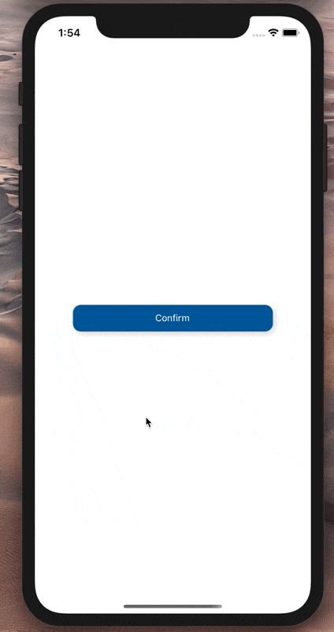

[](https://github.com/Paraboly/react-native-button)

[](https://www.npmjs.com/package/@paraboly/react-native-button)
[](https://www.npmjs.com/package/@paraboly/react-native-button)

[](https://opensource.org/licenses/MIT)
[](https://github.com/prettier/prettier)

<p align="center">
  
</p>

# Installation

Add the dependency:

```ruby
npm i @paraboly/react-native-button
```

## Peer Dependencies

###### IMPORTANT! You need install them

```js
"react": ">= 16.x.x",
"react-native": ">= 0.55.x",
"react-native-androw": ">= 0.0.34",
"react-native-spinkit": ">= 1.5.0",
```

# Usage

## Import

```js
import Button from "@paraboly/react-native-button";
```

## Basic Usage

```jsx
<Button onPress={() => {}} />
```

## Advanced Usage

You can simply `npm i` and `react-native run-ios/android` on example to run the it.

```jsx
import React, { useState } from "react";
import { StatusBar, SafeAreaView } from "react-native";
import Button from "./lib/Button";

const App = () => {
  const [spinnerVisibility, setSpinnerVisibility] = useState(false);
  return (
    <>
      <StatusBar barStyle="dark-content" />
      <SafeAreaView
        style={{ flex: 1, alignItems: "center", justifyContent: "center" }}
      >
        <Button
          width={300}
          spinnerEnable
          text="Confirm"
          spinnerVisibility={spinnerVisibility}
          onPress={() => {
            setSpinnerVisibility(true);
            setTimeout(() => setSpinnerVisibility(false), 1250);
          }}
        />
      </SafeAreaView>
    </>
  );
};

export default App;
```

# Configuration - Props

| Property          |   Type    |  Default  | Description                                               |
| ----------------- | :-------: | :-------: | --------------------------------------------------------- |
| text              |  string   |  Confirm  | change the button's centered text                         |
| onPress           | function  | undefined | set your own functionality when button is pressed         |
| width             |  number   |    150    | change the button's width                                 |
| height            |  number   |    40     | change the button's height                                |
| backgroundColor   |   color   |   #059    | change the button's backgroundColor                       |
| spinnerEnable     |  boolean  |   false   | enable it if you want to use the built-in spinner feature |
| spinnerVisibility |  boolean  |   false   | manage the spinner visibility                             |
| TextComponent     | component |   Text    | set your own Text component                               |

## Author

FreakyCoder, kurayogun@gmail.com

## License

React Native Built-in Spinner Button is available under the MIT license. See the LICENSE file for more info.
